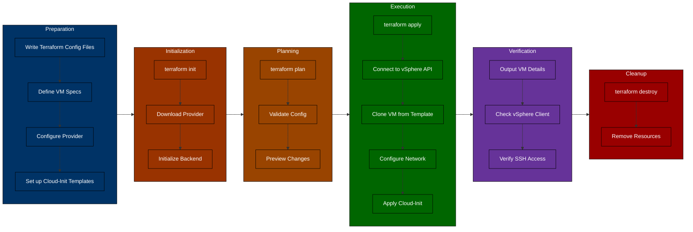

# Automating Ubuntu 24.04 VM Deployment with Terraform on VMware vSphere

If you're still clicking through the vSphere Client to deploy VMs one by one, you're wasting valuable time and introducing unnecessary risk. Having spent years managing infrastructure at scale, I've seen firsthand how manual VM creation falls apart as environments grow - inconsistent configurations, undocumented changes, and hours lost to repetitive tasks.

This tutorial shows you how to automate Ubuntu 24.04 VM deployments on vSphere using HashiCorp Terraform, building on the template creation process we covered in our previous Packer article. We'll walk through a practical implementation that scales from one VM to hundreds with minimal effort.

## Why Automate VM Deployment with Terraform?

Before diving into the technical details, let's understand why automating VM deployment with Terraform is crucial:

1. **Efficiency**: Deploy multiple virtual machines in seconds with a single command
2. **Consistency**: Every virtual machine is created exactly the same way, eliminating human error
3. **Version Control**: Store your infrastructure as code in source control
4. **Repeatability**: Create identical environments for development, testing, and production
5. **Scalability**: Easily scale up or down by modifying a few lines of code

Manual VM creation involves clicking through numerous screens in the vSphere Client, configuring settings, and waiting for processes to complete. With Terraform, we define the entire process in code and let automation handle the rest.

## Understanding the Terraform Environment

Our Terraform configuration consists of several key files:

- `main.tf`: The main Terraform configuration file that defines our vSphere provider and virtual machine resources
- `variables.tf`: Variable definitions for customizing our deployment
- `output.tf`: Output values that display important information after deployment
- `vars.auto.tfvars`: Default values for variables
- `terraform.tfvars`: Sensitive configuration variables (not checked into source control)
- `templates/`: Directory containing cloud-init configuration templates
  - `metadata.yaml`: Instance metadata template
  - `userdata.yaml`: User configuration template

Let's examine the environment requirements before proceeding:

- **VMware vCenter Server**: 7.0.3.01800 (Build number: 22837322)
- **VMware vSphere Hypervisor (ESXi)**: v6.7
- **HashiCorp Terraform**: v1.5.7
- **Terraform vSphere Provider**: v2.12.0
- **Ubuntu**: 24.04 LTS (using our Packer-built template)

## Terraform Workflow Overview

Before diving into the code, let's understand the complete workflow from configuration to deployment:



This workflow shows the complete lifecycle of VM deployment with Terraform:
1. **Preparation**: Creating the necessary configuration files
2. **Initialization**: Setting up the Terraform environment
3. **Planning**: Validating and previewing changes
4. **Execution**: Creating the virtual machines on vSphere
5. **Verification**: Confirming the deployment was successful
6. **Cleanup**: Optional removal of resources

Now, let's explore the configuration in detail.

## The Terraform Configuration

The core of our deployment is the `main.tf` file, which defines how we interact with the vSphere API and what resources we want to create. Let's break down the key sections:

### Provider Configuration

```hcl
terraform {
  required_providers {
    vsphere = {
      source  = "hashicorp/vsphere"
      version = "2.12.0"
    }
  }
}

provider "vsphere" {
  user                 = var.vsphere_user
  password             = var.vsphere_password
  vsphere_server       = var.vsphere_vcenter
  allow_unverified_ssl = true
}
```

This block configures the vSphere provider, which allows Terraform to communicate with our vSphere environment. We specify the provider version explicitly to ensure reproducible deployments and provide authentication credentials.

### Data Sources

Data sources allow Terraform to read attributes from existing infrastructure. We use them to retrieve information about our vSphere environment:

```hcl
data "vsphere_datacenter" "dc" {
  name = var.vsphere-datacenter
}

data "vsphere_datastore" "datastore" {
  name          = var.vm-datastore
  datacenter_id = data.vsphere_datacenter.dc.id
}

data "vsphere_compute_cluster" "cluster" {
  name          = var.vsphere-cluster
  datacenter_id = data.vsphere_datacenter.dc.id
}

data "vsphere_network" "network" {
  name          = var.vm-network
  datacenter_id = data.vsphere_datacenter.dc.id
}

data "vsphere_virtual_machine" "template" {
  name          = "/${var.vsphere-datacenter}/vm/${var.vsphere-template-folder}/${var.vm-template-name}"
  datacenter_id = data.vsphere_datacenter.dc.id
}
```

These data sources retrieve information about our datacenter, datastore, compute cluster, network, and template VM. This information is then used when creating our virtual machines.

### Virtual Machine Resource

The heart of our configuration is the virtual machine resource block, which defines what VMs we want to create:

```hcl
resource "vsphere_virtual_machine" "vm" {
  for_each = local.vms

  name             = each.value.name
  resource_pool_id = data.vsphere_compute_cluster.cluster.resource_pool_id
  datastore_id     = data.vsphere_datastore.datastore.id

  num_cpus             = each.value.cpu
  num_cores_per_socket = var.cores-per-socket
  memory               = each.value.ram
  guest_id             = var.vm-guest-id

  network_interface {
    network_id   = data.vsphere_network.network.id
    adapter_type = data.vsphere_virtual_machine.template.network_interface_types[0]
  }

  disk {
    label            = "${each.value.name}-disk"
    thin_provisioned = data.vsphere_virtual_machine.template.disks.0.thin_provisioned
    eagerly_scrub    = data.vsphere_virtual_machine.template.disks.0.eagerly_scrub
    size             = each.value.disksize
  }

  clone {
    template_uuid = data.vsphere_virtual_machine.template.id
  }

  extra_config = {
    "guestinfo.metadata" = base64encode(templatefile("${path.module}/templates/metadata.yaml", merge(local.common_templatevars, {
      name         = each.value.name,
      ipv4_address = each.value.ipv4_address
    })))
    "guestinfo.metadata.encoding" = "base64"

    "guestinfo.userdata" = base64encode(templatefile("${path.module}/templates/userdata.yaml", merge(local.common_templatevars, {
      name = each.value.name
    })))
    "guestinfo.userdata.encoding" = "base64"
  }

  firmware                = "efi"
  efi_secure_boot_enabled = false
}
```

This resource block uses the `for_each` meta-argument to create multiple virtual machines in parallel. Each VM is configured with the specified CPU, memory, disk, and network settings. The `clone` block specifies that we want to clone from our template VM, and the `extra_config` block provides cloud-init configuration for first-boot customization.

## Cloud-Init Configuration

One of the powerful features of our VM deployment is the cloud-init integration, which allows us to customize the VM at first boot. We use two template files:

### metadata.yaml

```yaml
#cloud-config
local-hostname: ${name}
instance-id: ubuntu-${name}
network:
  version: 2
  ethernets:
    ens192:
      dhcp4: false
      addresses:
        - ${ipv4_address}/24
      gateway4: ${ipv4_gateway}
      nameservers:
        search: [home]
        addresses: [${dns_server_1}, ${dns_server_2}]
growpart:
  mode: auto
  devices: ['/dev/sda2']
  ignore_growroot_disabled: true
wait-on-network:
  ipv4: true
```

This template configures the hostname, network settings, and storage options for the VM.

### userdata.yaml

```yaml
#cloud-config
users:
  - name: ${ssh_username}
    ssh-authorized-keys:
      - ssh-rsa ${public_key}
    sudo: ['ALL=(ALL) NOPASSWD:ALL']
    groups: sudo
    shell: /bin/bash
packages:
  - tree
```

This template configures the user account, SSH keys, and packages to install on the VM.

## Defining Multiple VMs

One of the strengths of our configuration is the ability to define multiple VMs in a single file. This is done using a `locals` block in the `variables.tf` file:

```hcl
locals {
  vms = {
    "vm1" = {
      name         = "ubuntu24-04-vm1"
      ipv4_address = "192.168.1.97"
      cpu          = var.cpu
      ram          = var.ram
      disksize     = var.disksize
    },
    "vm2" = {
      name         = "ubuntu24-04-vm2"
      ipv4_address = "192.168.1.98"
      cpu          = var.cpu
      ram          = var.ram
      disksize     = var.disksize
    }
  }

  common_templatevars = {
    ipv4_gateway = var.ipv4_gateway,
    dns_server_1 = var.dns_server_list[0],
    dns_server_2 = var.dns_server_list[1],
    public_key   = var.public_key,
    ssh_username = var.ssh_username
  }
}
```

To add more VMs, simply add more entries to the `vms` map with the desired name, IP address, and hardware specifications.

## Step-by-Step Deployment Process

Now that we understand the configuration, let's walk through the deployment process:

### 1. Initialize Terraform

First, we need to initialize Terraform to download the required providers:

```bash
terraform init
```

This command downloads the vSphere provider and sets up the Terraform working directory.

### 2. Plan the Deployment

Next, we create an execution plan to see what resources will be created:

```bash
terraform plan -out=tfplan
```

This command shows us what changes Terraform will make to our infrastructure. In our case, it will create two virtual machines.

### 3. Apply the Changes

Finally, we apply the changes to create our virtual machines:

```bash
terraform apply tfplan
```

This command creates the virtual machines as defined in our configuration. The process takes about 6 minutes to complete.

### 4. Verify the Deployment

After the deployment is complete, Terraform outputs the IP addresses and names of our virtual machines:

```
Outputs:

ip_addresses = {
  "vm1" = "192.168.1.97"
  "vm2" = "192.168.1.98"
}
vm_names = {
  "vm1" = "ubuntu24-04-vm1"
  "vm2" = "ubuntu24-04-vm2"
}
```

We can now verify that the VMs are running in the vSphere Client and SSH into them to confirm that they are properly configured.

### 5. Clean Up

When we're done with the virtual machines, we can easily destroy them with a single command:

```bash
terraform destroy
```

This command removes all resources created by Terraform, ensuring a clean slate for future deployments.

## Demo of the Process

Let's walk through a demo of the entire process:

1. **Initial Setup**: We have our Ubuntu 24.04 template that was generated with Packer in the templates folder in vCenter.

2. **Running Terraform Commands**: We run `terraform init`, `terraform plan`, and `terraform apply` to create our virtual machines.

3. **VM Creation**: Terraform creates the VMs in parallel, cloning them from our template and applying our custom configuration.

4. **Verification**: We can see the VMs being created in the vCenter UI, and once they're running, we can SSH into them to verify that they're properly configured.

5. **Clean Up**: When we're done, we run `terraform destroy` to remove the VMs.

The entire process is automated, efficient, and repeatable, saving us time and ensuring consistency across deployments.

## Benefits of Terraform for vSphere VM Management

Using Terraform for vSphere VM management offers several benefits:

1. **Infrastructure as Code**: All our VM configurations are defined in code, allowing for version control, review, and automation.

2. **Parallel Deployment**: Terraform can create multiple VMs in parallel, significantly reducing deployment time.

3. **Consistency**: Every VM is created exactly the same way, eliminating human error and ensuring consistent environments.

4. **Flexibility**: We can easily modify our configuration to add, remove, or update VMs without having to click through the vSphere Client.

5. **Integration**: Terraform integrates with other tools in our infrastructure automation pipeline, such as Packer for template creation.

## Advanced Features

Our Terraform configuration includes several advanced features:

### Custom Cloud-Init Configuration

We use cloud-init to customize our VMs at first boot, allowing us to configure networking, users, SSH keys, and packages without manual intervention.

### EFI Firmware Support

Our VMs are configured to use EFI firmware instead of BIOS, providing better compatibility with modern operating systems.

### Static IP Addressing

We assign static IP addresses to our VMs, ensuring consistent network configurations and making it easier to integrate with other infrastructure components.

### For_Each Meta-Argument

We use the `for_each` meta-argument to create multiple VMs in parallel, reducing deployment time and making our configuration more maintainable.

## Conclusion

Automating Ubuntu 24.04 VM deployment on VMware vSphere with Terraform offers significant benefits in terms of efficiency, consistency, and scalability. By defining our infrastructure as code, we can create, modify, and destroy VMs with simple commands, eliminating the need for manual intervention through the vSphere Client.

The combination of Packer for template creation and Terraform for VM deployment provides a powerful automation pipeline that can be integrated into larger infrastructure management workflows. This approach is particularly valuable in environments where multiple VMs need to be created and managed efficiently.

No more manual clicks, no more inconsistencies, no more wasted time - just efficient, automated, and repeatable VM deployment with Terraform.

## Next Steps

- Learn how to integrate Terraform with CI/CD pipelines for automated infrastructure deployment
- Explore more advanced Terraform features, such as modules and workspaces
- Implement monitoring and logging for your virtual machines to gain deeper insights into their performance and health
- Take your Terraform skills to the next level with our comprehensive [Terraform 101 course](https://tekanaid.com/course/terraform-101/)

By embracing infrastructure as code with Terraform, you're taking a significant step toward modern, efficient infrastructure management that can scale with your organization's needs. 